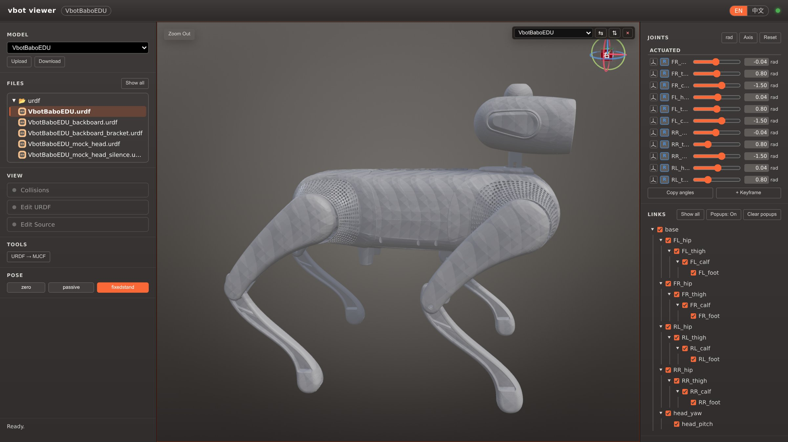

# Vbot Viewer：查看与编辑机器人模型

<a href="vbot-viewer.md">English</a> | 中文

[打开 Vbot Viewer](https://vbot-viewer.vitarobot.cc/?model=VbotBaboEDU)，
浏览四足 EDU 模型、查看关节与连杆、编辑 URDF 并导出模型文件。
工具在浏览器中运行；查看模型不需要 SSH、Docker、SDK，也不需要连接机器人。

Viewer 用于**机器人描述与模型姿态**；[Foxglove](foxglove.zh-CN.md) 用于**设备实时消息**。
拖动 Viewer 关节滑条不会控制真实机器人，导出姿态也不会生成可部署的运控轨迹。

总览图使用英文界面，具体模型提供的控件可能不同。页头可通过 **EN / 中文** 切换语言。

## 1. 打开模型

1. 使用 Chrome、Edge 等现代浏览器打开上方链接。
2. 如提示登录，使用页面提供的账户方式登录。新用户点击**注册**，按页面说明完成申请／激活。
   无法登录时使用**忘记密码**恢复访问；不要在公开帖子中分享账户或设备绑定信息。
3. 在**模型**中选择 **VbotBaboEDU**。链接的 `?model=VbotBaboEDU` 用于选择共享模型，
   不是设备地址，也不是机器人实时连接。
4. 在**文件**中选择需要的 URDF，查看或编辑前确认模型名称与文件名。

仓库中的模型位置是 [assets/robots/foot_quadruped](../../assets/robots/foot_quadruped/README.zh-CN.md)。
该目录附带 VbotBaboEDU 的 URDF 与网格快照；在线模型可能独立更新，本地入口文件以 `model.json` 为准。
网站中显示其他机器人模型，不代表这些设备类型已开放 EDU 接口。

## 2. 查看结构与模型姿态

| 任务 | 操作 | 关注内容 |
| --- | --- | --- |
| 调整视角 | 左键拖动旋转、右键拖动平移、滚轮缩放 | 用方向立方体切换到面的正交视图 |
| 查找部件 | 悬停连杆或在 **Links／连杆** 中选择 | 连杆名称、相对父连杆位置、质量、质心与惯量 |
| 保留信息 | 双击连杆固定弹窗 | 单独关闭弹窗，或使用 **Clear popups／清除弹窗** |
| 理解关节轴 | **Axis／坐标轴** 按钮与关节滑条 | 关节名称、旋转／移动轴与声明的限位 |
| 查看接触几何 | **Collisions／碰撞体** | 区分碰撞体与视觉网格，两者是不同模型元素 |
| 查看声明的惯量 | 可用时打开 **Inertia／惯性** | 等效惯性盒的位置与形状；可疑数值回到 URDF 排查 |
| 对比模型变体 | 拆分视口，各窗格选择模型／文件 | 侧边面板作用于当前聚焦窗格 |

旋转关节按 **rad / deg** 选择弧度或角度；移动关节使用米。
显示的限位与物理属性来自模型，并非已连接设备的实测值。
模型姿态看起来合理，不代表真实机器人能安全到达该姿态。

**Pose／姿态**按钮加载模型关键帧。**Copy angles／复制角度**导出关节数值，
用于其他程序时应保留关节顺序、名称和单位。
共享模型的 **+ Keyframe／+ 关键帧**会在服务端保存命名姿态，其他用户也能看到。
只有确实希望进行共享修改时才使用，它不同于保存本地 URDF 编辑。

## 3. 编辑并保存本地变体

1. 选择正确的模型／文件，并聚焦对应视口。
2. 打开 **Edit URDF／编辑 URDF** 使用连杆／关节表单，或打开 **Edit Source／编辑源码**
   配合三维预览编辑 XML。按需检查原点、坐标轴、限位、惯性字段与碰撞几何。
3. 修复 XML 错误后再保存。**Ctrl+S** 首次保存会创建命名的本地变体，
   **Ctrl+Shift+S** 另存一份；在**文件**中选择保存的变体。
4. 需要长期保留时使用 **Download／下载**，选中目标 URDF 变体；模型网格会随压缩包一起导出。

本地变体保存在当前浏览器，不覆盖共享模型。清除站点数据会删除它们，
换电脑或浏览器也不会自动同步，因此清理数据前应先下载备份。
网站共享模型与仓库模型快照可能独立更新，不应默认版本一致。

自己的模型可通过 **Upload／上传**或拖入文件夹打开；文件夹中需要恰好一个 `.urdf`
及其引用的网格。上传浏览器本地模型不等于发布到共享模型库；不支持浏览器本地 `.xacro` 上传。

| 模型来源 | 浏览／编辑／下载 | 服务端 URDF 校验与 MJCF 转换 | 共享关键帧 |
| --- | --- | --- | --- |
| 共享模型，包括基于它创建的本地编辑变体 | 支持 | 对应工具可用时支持 | 共享模型可用，会影响其他用户 |
| 自己上传的浏览器本地模型 | 支持 | 不支持 | 不支持 |

本地保存不代表所有操作都离线：URDF 校验、修复和 MJCF 转换涉及服务端处理，
只提交你有权交由该服务处理的模型内容。

## 4. 检查与导出模型

对共享模型或基于它创建的本地变体：

1. 在 **Tools／工具 → URDF 校验**检查当前聚焦的模型。阅读错误与警告，
   再打开校验叠加层定位相关连杆。
2. 区分报告级别：**ERROR** 表示确定的结构／物理不一致，**WARNING** 需要进一步排查，
   **INFO** 可能说明跳过的检查。检查基于 URDF 零位，不采用当前滑条设置的姿态。
3. 按需导出 PDF 报告或复制 AI 修复提示词，将相关模型文件和报告交给编码助手，
   审阅修改后重新检查模型。不要自动将模型修改应用到真实机器人。
4. 下载选定的 URDF 变体与网格。需要 MuJoCo 输入时，使用 **URDF → MJCF**，
   选择完整几何或仅碰撞体版本，再下载产物。

**修复 URDF**会调整模型描述，包括关节轴约定与网格碰撞体，并生成新的本地变体。
如果某个轴的方向翻转，应对应检查角度符号、关键帧与控制器数值。
保留原模型，不要假设原有控制参数仍能直接混用。

模型校验能发现不一致，但不能证明真实硬件参数准确、控制器兼容或运动安全。
MJCF 转换只是导出步骤，不等于提供了完整仿真或真机部署流程。

## 5. 获取帮助

| 现象 | 优先检查 |
| --- | --- |
| 无法登录或激活 | 按页面的激活／找回流程处理，不公开密码、验证码或设备 SN |
| 本地模型缺少网格 | 补齐引用文件，并保持模型目录内路径可解析 |
| 找不到保存的编辑 | 检查浏览器、所选变体及已导出的备份 |
| 无法校验或转换 | 对照上方模型来源表；浏览器本地上传模型不支持这些服务端工具 |
| 控件修改了另一视图 | 先聚焦目标窗格，再使用侧边面板 |
| 模型重新加载 | 共享模型可能已更新，保留已导出的本地成果 |

仍未解决，或有改进建议？欢迎到 [Vbot 超能社区](https://forum.vbot.cn/) 反馈。
Viewer 问题请附模型／文件名、浏览器版本、操作步骤，以及脱敏截图或简短错误信息。
[社区与支持](../community/README.zh-CN.md)提供对应板块和可复制的反馈模板。
解决后也欢迎在原帖补充方法，帮助其他开发者。
