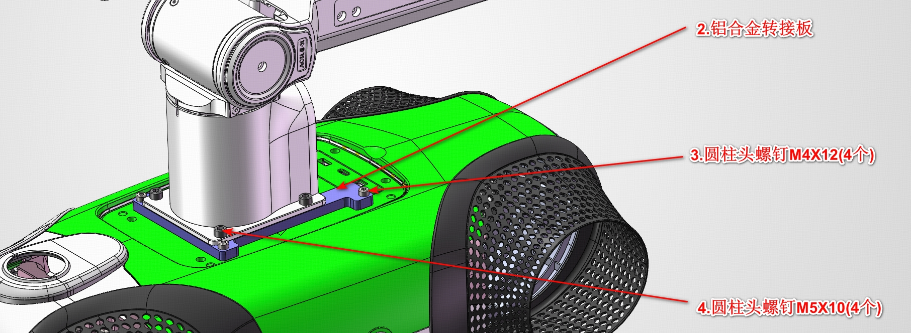

# 机器狗共用背部安装尺寸与机械臂转接板

<a href="back-mounting.md">English</a> | 中文

本参考用于核对背部安装孔，设计机械臂或其他附件的转接结构。
这套安装尺寸、转接板及图示紧固件配置由四足机器狗（`foot_quadruped`）
与轮式四足机器狗（`wheel_quadruped`）共用，不适用于双足机器人（`foot_humanoid`）。

两类机器狗引用同一份资料，不重复维护。共用机械结构不改变
[EDU 软件发布范围](../../robots/README.zh-CN.md)。

这些资料是机械图纸与零件 CAD 模型，不是机器人 URDF、机械臂控制接口，
也不代表已明确支持的负载能力。

## 图纸与 CAD 文件

| 文件 | 用途 |
| --- | --- |
| [背部安装孔尺寸（PDF）](assets/back-mounting/back-mounting-holes.pdf) | 定位机器人侧螺纹孔，查阅背部盖板参考尺寸 |
| [机械臂转接板（PDF）](assets/back-mounting/arm-adapter-plate.pdf) | 查阅转接板尺寸、孔位、公差、材料与表面处理 |
| [机械臂转接板（STEP）](assets/back-mounting/arm-adapter-plate.step) | 在 CAD 软件中导入转接板；模型长度单位为毫米 |
| [安装示意与清单（JPEG）](assets/back-mounting/arm-installation.jpeg) | 辨认转接板和两组紧固件 |

下载 STEP 后使用兼容的 CAD 软件打开，不要将其作为 URDF 上传到
[Vbot Viewer](../../guides/vbot-viewer.zh-CN.md)。机器人描述文件的提供情况见
[机器人模型](../../../assets/robots/README.zh-CN.md)。
工程图保留原始标注；下表整理了关键尺寸与安装图中的中文标号，英文版提供对应解释。

## 关键尺寸速查

以下尺寸单位均为 **mm**。对应特征以 PDF 中的尺寸线为准，不要通过测量截图推算尺寸。

| 特征 | 图纸标注 |
| --- | --- |
| 机器人侧安装孔 | 4 × M4，螺纹深度 6 |
| 机器人侧孔中心距 | 115.5 × 89 |
| 背部盖板其他参考跨度 | 152 × 109，具体位置见背部安装图；不代表附件可用安装面积 |
| 转接板外形尺寸 | 125.5 × 99；厚度 7 |
| 转接板与机器人连接的间隙孔 | 4 × Ø4.50 贯穿；孔中心距 (115.5 ±0.2) × (89 ±0.2) |
| 机械臂与转接板连接的螺纹孔 | 4 × M5-6H 贯穿；Ø4.20 贯穿底孔；孔中心距 (70 ±0.2) × (70 ±0.2) |
| 转接板材料与表面处理 | 6061 铝合金，本色阳极氧化 |

其余开口、偏距、未注尺寸公差及形位要求见转接板 PDF。
图纸注明未标出的尺寸参考 3D 模型。加工时应使用完整图纸，不应以上述摘要代替。

## 安装示意与零件清单

| 图中标号 | 零件 | 数量 | 图示连接位置 |
| --- | --- | --- | --- |
| 2 — 铝合金转接板 | 铝合金转接板 | 1 | 机器人背部安装板与机械臂底座之间 |
| 3 — 圆柱头螺钉 M4×12 | 圆柱头螺钉 M4×12 | 4 | 转接板连接机器人 |
| 4 — 圆柱头螺钉 M5×10 | 圆柱头螺钉 M5×10 | 4 | 机械臂底座连接转接板 |

转接板图中的**完全贯穿**对应 **through**，**未注尺寸公差**指没有单独标出公差的尺寸所采用的公差，
**本色阳极氧化**对应 **clear anodized finish**。

上述紧固件对应图示装配。转接板厚度、机械臂底座厚度或垫片发生变化时，
需重新核对螺钉长度和实际啮合深度，避免螺钉在机器人盲孔内顶到底。

## 安装附件前

- 安装时关闭机器人电源并保持稳定支撑，核对实物安装面的孔距、螺纹深度和空间。
- 不遮挡连接器、散热开口或机器人活动部件，检查附件及线缆在预期运动范围内是否干涉。
- 本资料未规定负载、允许力矩、重心范围、紧固扭矩或适配机械臂型号。
  运行前须针对实际机器人与附件组合确认这些要求。
- 机械安装匹配不等于已提供机械臂供电、通信、驱动或运动协同能力，
  不要从示意图或 STEP 文件推断这些功能。

对安装适配有疑问，可通过[社区与支持](../../community/README.zh-CN.md)反馈，
附上对应图纸、硬件型号和需要确认的尺寸或接口。
