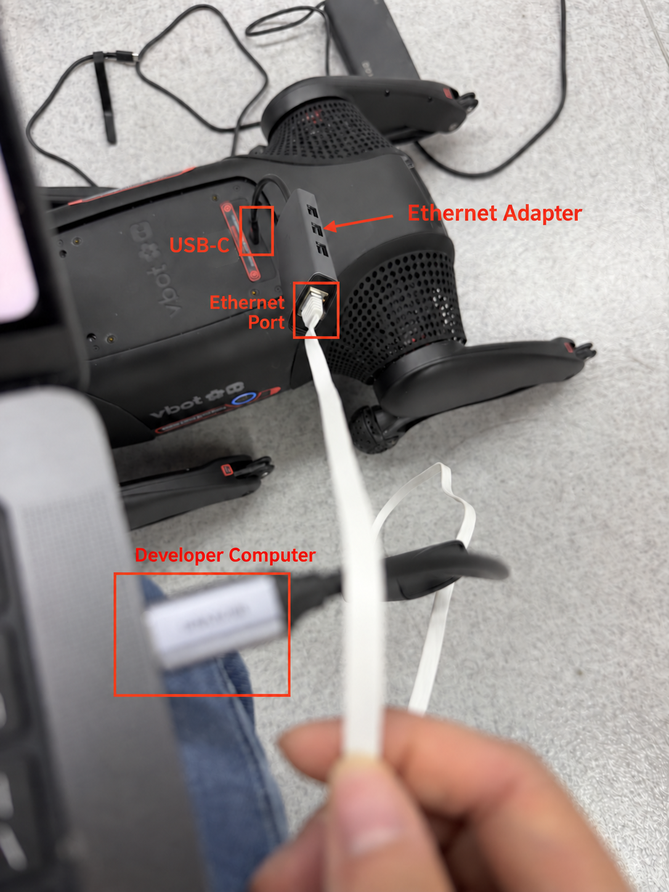

# Robot-dog wired connection and SSH login

<p align="center">English | <a href="connection.zh-CN.md">中文</a></p>

Four-legged robot dogs (`foot_quadruped`) and four-wheeled robot dogs (`wheel_quadruped`)
use the same wired connection, network settings, and SSH login procedure described here.
It connects your computer to the robot and opens a terminal using the `vbot` account;
it does not install an SDK, deploy an application, or start robot motion.
These instructions do not apply to bipedal robots (`foot_humanoid`).
The current EDU release scope remains `foot_quadruped` only; a shared connection procedure
does not establish firmware, SDK, or API availability for `wheel_quadruped`.

## 1. Connect the Ethernet cable

Prepare a USB-C Ethernet adapter, an Ethernet cable, and a computer with an Ethernet
port or a compatible Ethernet adapter. Keep the robot stationary in a safe location.



The photo shows a four-legged robot dog; the same connection method applies to both robot-dog types.
Photo labels: **USB-C** — robot USB-C port; **Ethernet Adapter** — USB-C Ethernet adapter;
**Ethernet Port** — Ethernet port; **Developer Computer** — your development computer.

1. Connect the USB-C Ethernet adapter to the robot's USB-C port.
2. Connect an Ethernet cable between that adapter and your computer's Ethernet port.
3. Power on the robot and wait for it to finish starting up. Check that your computer
   detects the wired connection.

Configure the computer's physical network interface and run the SSH command from
the computer's terminal. You do not need to start the development container for this step.

## 2. Configure the computer's network interface

In your operating system's network settings, select the wired interface connected
to the robot and configure IPv4 manually:

| Setting | Value |
| --- | --- |
| Computer IPv4 address | `192.168.126.100` (recommended) |
| Subnet mask | `255.255.255.0` (prefix length `24`) |
| Network | `192.168.126.0/24` |
| Robot IPv4 address | `192.168.126.2` |
| Gateway / router and DNS | Leave blank for this direct connection |

**Do not assign `192.168.126.2` to your computer:** that address belongs to the robot.
If you use a different computer address, choose an unused host address in the same subnet.
Only change the interface connected to the robot, not an unrelated Wi-Fi or other
network interface. If a VPN or another interface already uses this subnet, resolve
the routing conflict before connecting.

## 3. Verify the first SSH login

Prefer public-key login for subsequent operations. If it already works, skip setup and use
the verification in step 4. Otherwise, first establish a trusted interactive connection.
The examples use the wired address `192.168.126.2`; replace it throughout with your actual
device IP or configured SSH alias when different. Run this command in your computer's terminal:

```bash
ssh vbot@192.168.126.2
```

The username is `vbot` and the initial password is `vbot`. If the password has been
changed, use the current password. Password entry normally shows no characters.

On the first connection, SSH may ask you to confirm the device's host-key fingerprint.
Verify the fingerprint before accepting it. If SSH later reports a changed host key,
check the device identity before proceeding; do not disable host-key checking.

Once logged in, check the account:

```bash
whoami
```

The expected output is `vbot`. Every robot ships with the same initial password, so anyone on
the same network who knows it can log in. If the account still uses `vbot`, change the password
now, in the same session:

```bash
passwd
```

`passwd` asks for the current password, then the new one twice. Choose a password used only
for this robot and keep it somewhere safe: you need it to install your public key in step 4
and whenever key login is unavailable. Change it again when the robot changes hands.

To close the session and return to your computer's terminal:

```bash
exit
```

Use this connection on a trusted local network. Do not expose or forward SSH or other
device service ports to untrusted networks or the Internet.

## 4. Configure public-key login

Run these commands on the computer, **not in the robot's SSH terminal**. The examples use
Linux / WSL OpenSSH tools and `timeout`. Configure and verify access in the environment
that will issue subsequent SSH commands; a working host login does not prove a container
or a different terminal session has the same key or SSH-agent access.

### Choose a key

Reuse an existing suitable key pair if available. If none exists, generate a new one:

```bash
ssh-keygen -t ed25519 -f ~/.ssh/id_ed25519 -C "vbot-dev"
```

This example assumes both `~/.ssh/id_ed25519` and `~/.ssh/id_ed25519.pub` are unused.
Never overwrite an existing key: skip generation to reuse it, or choose an unused filename
and adjust all commands below. Use a passphrase to protect the private key. With a running
local SSH agent, load the key once for subsequent operations:

```bash
ssh-add ~/.ssh/id_ed25519
```

If no SSH agent is available, use your operating system's agent, or start one on Linux / WSL
with `eval "$(ssh-agent -s)"`, then run `ssh-add`. Subsequent tools must inherit access to that
agent (`SSH_AUTH_SOCK`). Passwordless device login does not require an unencrypted private key;
the local agent can handle a passphrase-protected key. Do not enable agent forwarding to the robot.

### Install only the public key

```bash
ssh-copy-id -i ~/.ssh/id_ed25519.pub vbot@192.168.126.2
```

Enter the device's current account password interactively if prompted; the initial password
is `vbot`. This setup adds the selected public key to the `vbot` account's `~/.ssh/authorized_keys`,
preserving existing entries. It is a device configuration change, not a read-only check.
Only the `.pub` file is installed; keep the private key on your computer and out of the repository.
If key installation is unavailable or denied, stop and report the error rather than changing
device access controls or SSH server settings.

### Verify non-interactive access

After checking and saving the host-key fingerprint, test a fresh public-key-authenticated
connection from the same environment that will run subsequent operations:

```bash
timeout 10s ssh -i ~/.ssh/id_ed25519 \
  -o BatchMode=yes -o PreferredAuthentications=publickey \
  -o IdentitiesOnly=yes -o StrictHostKeyChecking=yes -o ControlPath=none \
  -o ConnectTimeout=5 -o ConnectionAttempts=1 \
  vbot@192.168.126.2 whoami
```

Success means exit status `0` and output `vbot`, without asking for an account password or
key passphrase. `ControlPath=none` avoids reusing a previous password-authenticated connection.
If authentication fails, check the selected key, installed public key and local agent; do not
automatically retry with a password. If SSH is unreachable or refused, stop and ask the user
to connect the device using this guide or provide its actual IP before continuing.
Treat host-key warnings separately and verify the device identity; do not disable checking.

Once verified, reuse the selected target and key for later SSH commands. Load the
[device shell environment](../../getting-started/device-environment.md) before using Aorta or
ROS 2. Public-key setup does not change the `vbot` account's permissions or authorize additional
device operations. Advice-only requests and offline checks do not connect or install keys.

## Connection troubleshooting

| Symptom | What to check |
| --- | --- |
| No wired link | Robot power and startup, the USB-C adapter, the Ethernet cable, and the computer's selected interface |
| Connection timeout or no route | Computer address and subnet mask, address conflicts, VPNs, and competing routes to `192.168.126.0/24` |
| Connection refused | Confirm the address and allow the robot to finish starting; if it persists, check device-version support |
| Password rejected | Use the `vbot` username and the device's current password |
| Public-key login rejected | Check the selected identity, installed public key and local SSH agent; do not fall back to automatic password login |
| Host-key warning | Verify the device identity before accepting a new key |

## Next steps

For the current `foot_quadruped` EDU software, continue with
[device shell configuration and checks](../../getting-started/device-environment.md).
This software step is separate from the shared connection procedure.

Continue with the [development environment](../../getting-started/README.md),
[development workflow](../../development/README.md), or
[Agent interfaces](../../interfaces/agent/README.md).
`192.168.126.2` is the computer-to-device SSH address. For other interfaces, follow
their documented execution environment and endpoint instead of substituting this address.
A successful SSH login does not by itself verify SDK or API availability.

Return to the [four-legged EDU guide](../foot_quadruped/README.md) or the
[four-wheeled robot-dog reference](../wheel_quadruped/README.md).
